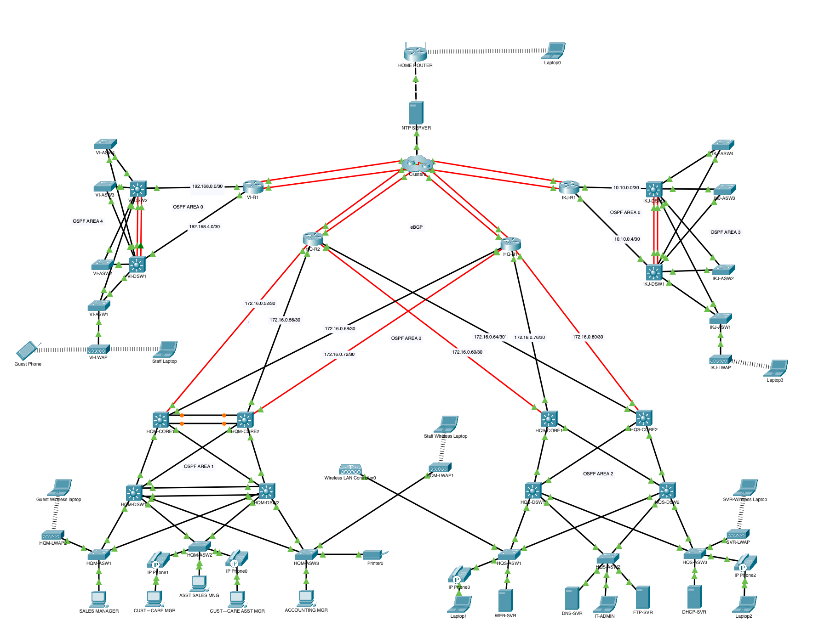

# Secure Enterprise Network Architecture with Dual-Homed eBGP, Multi-Area OSPF, and Centralized Wireless Control 

**Protocols & Technology Covered Yet**: HSRP, OSPF Multi-Area, eBGP, DHCP, DNS, Web Server, WLC, NTP, EtherChannel and more

**Note**: I would be updating this documentation as I proceed

 

## 🎯 Objective  
This lab simulates an enterprise-grade network integrating high availability, dynamic routing, centralized services, and multi-site architecture. It includes:  

- Redundant default gateway using HSRP  
- Dedicated servers at the HQ Server Farm  
- Multi-area OSPF intra and inter-site routing  
- Inter-AS communication via eBGP  
- Central DHCP, DNS, and HTTP services  
- Wireless infrastructure Management using WLC  
- Remote User connectivity

 

## 🖥️ Topology Diagram  

 

- **Access layer** handles Layer 2 management and security.  
- **Distribution layer** aggregates traffic, manages local inter-VLAN routing and DHCP services.  
- **Core layer** handles multi-area OSPF routing and external forwarding decisions.  
- **Edge routers** run eBGP for inter-site communication with two ISPs.  

_This design ensures high availability and eliminates single points of failure from the access layer to the ISP edge._

 

## 🧩 Devices Included, VLAN Naming, and IP Addressing Plan 

📌 Click the spreadsheet image for a complete list of IP addresses, interface roles, and link purposes across all interconnects.

